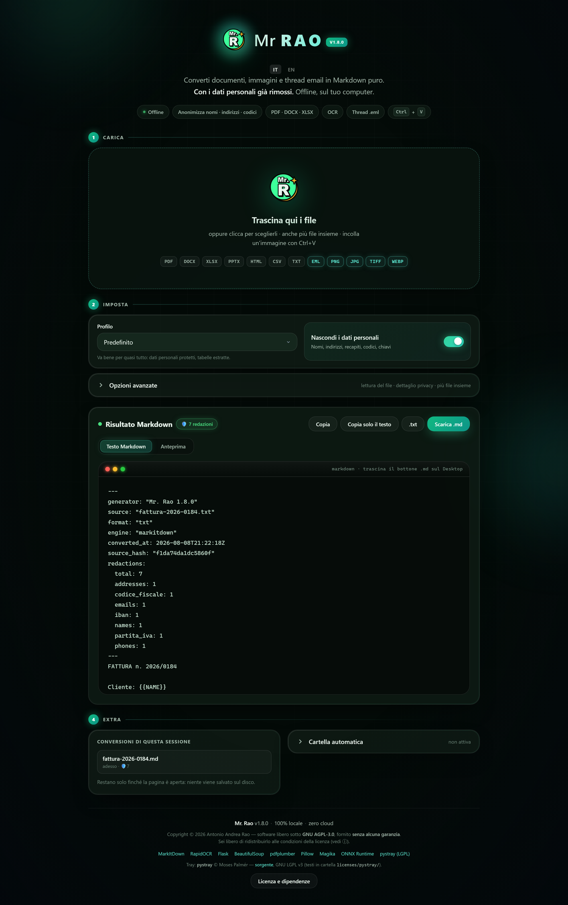

# Mr. Rao

[English](README.md) · **Italiano**

**Trasforma PDF, Word, Excel, scansioni ed email in Markdown pulito — con i dati personali già rimossi.**
**In uscita `.md`, `.txt` o `.docx`: tutti e tre già anonimizzati.**
**Tutto sul tuo computer, senza mandare niente a nessuno.**

[](https://github.com/AntonioRao/mr-rao/releases/latest/download/MrRao-Portable.zip)

[](https://github.com/AntonioRao/mr-rao/actions/workflows/ci.yml)
[](docs/CHANGELOG.md)
[](tests/)
[](#come-fa-a-essere-davvero-locale)
[](LICENSE)
[](docs/PORTABLE.md)


### [⬇️ Scarica per Windows — nessun Python richiesto](https://github.com/AntonioRao/mr-rao/releases/latest/download/MrRao-Portable.zip)

*Estrai lo zip, doppio clic su `Installa Mr Rao.bat`. Fatto.*
<sub>Lo scaricamento parte subito. [Tutte le versioni e le note di rilascio](https://github.com/AntonioRao/mr-rao/releases) · [changelog](docs/CHANGELOG.md)</sub>

<sub>**Vuoi essere sicuro che sia il file giusto?** Il pacchetto è firmato con [Sigstore](https://www.sigstore.dev/): `gh attestation verify MrRao-Portable.zip --repo AntonioRao/mr-rao` dice se è uscito davvero da questo repository, da quale commit e da quale build. Nessuna chiave da procurarsi. Dettagli e limiti in [PORTABLE.md](docs/PORTABLE.md#verificare-il-pacchetto). Il pacchetto **non** è ancora firmato per Windows, quindi Windows continua a chiamare sconosciuto l'editore: è stata inviata una domanda di firma gratuita alla [SignPath Foundation](https://signpath.org/), e la [policy di firma del codice](docs/CODE-SIGNING-POLICY.md) dice cosa cambierà e cosa no quando verrà accolta.</sub>


<sub>Un `.eml` con dati inventati: nomi, email, telefoni e IBAN diventano segnaposto. Il numero di protocollo e la data restano dov'erano — il motore non redige quello che non deve.</sub>



> **Interfaccia e documento in italiano o in inglese**, scelti dal browser e cambiabili con un clic. Oltre ai formati italiani il motore riconosce quelli britannici, statunitensi, canadesi e australiani: NHS number, National Insurance number, SSN, ITIN, routing bancario ABA, SIN, ABN, TFN, codice postale britannico e la zona a lettura automatica dei passaporti.

---

## Il problema

Vuoi dare un documento in pasto a un assistente AI. Ti servono due cose:

1. il testo, pulito, non un PDF;
2. **non** consegnare al fornitore il codice fiscale del tuo cliente.

Gli strumenti online risolvono il primo problema creando il secondo: per convertire il file glielo devi caricare. Se quel file è una fattura, una cartella clinica, un contratto o un thread email con dentro persone reali, l'hai appena spedito a un server di cui non sai nulla.

Mr. Rao fa la conversione **e** l'anonimizzazione dei dati personali sul tuo computer. Il file non si muove.

### E non tutto finisce dentro un prompt

Un atto da pubblicare all'albo pretorio, un contratto da depositare, una delibera anonimizzata **devono restare documenti** — in Markdown non lo sono. Per questo l'uscita non è solo `.md`: c'è anche il testo semplice `.txt` e il **documento Word `.docx`**, con la stessa redazione applicata.

Una precisazione che conviene leggere prima di usarlo. **Non è il documento originale con sopra dei rettangoli neri.** Quella è la trappola classica della redazione: i rettangoli si tolgono e il testo è ancora lì sotto, e ogni anno qualcuno pubblica un atto così. Qui il documento viene rigenerato dal Markdown già redatto, quindi il dato non è coperto — è assente. Il prezzo è l'impaginazione dell'originale, che si perde.

---

## Il motore di anonimizzazione

La conversione la fa [MarkItDown](https://github.com/microsoft/markitdown), che è di Microsoft ed è ottimo. **Questa è la parte che non trovi altrove.**

### Il numero deve dimostrare di essere un IBAN

Ogni riconoscitore è una coppia: un'espressione regolare che propone candidati, e un validatore che decide. Il pattern non basta mai.

| dato | come viene deciso |
|------|-------------------|
| IBAN | **mod-97** (ISO 13616) |
| Carta di pagamento | **Luhn** (ISO/IEC 7812) |
| Telefono | prefisso `+39`, prefisso cellulare `3xx`, separatori, o una parola di contesto davanti |
| P.IVA | prefisso `IT` o contesto fiscale nei caratteri precedenti |
| Indirizzo | dopo «via», «piazza», «corso» deve seguire una parola con l'iniziale maiuscola |
| Data di nascita | solo accanto a «nato il», «data di nascita» |
| Carta d'identità, patente, passaporto | **serve il tipo di documento scritto vicino**: questi numeri non hanno una cifra di controllo |

Su quest'ultima riga vale la pena fermarsi, perché è il caso in cui il metodo mostra il suo limite e cosa ci si fa. Un numero di patente non ha nulla da dimostrare: `MI5512340V` e un codice di protocollo hanno la stessa forma, e nessun conto può dire quale sia quale. Sostituire a vista vorrebbe dire cancellare mezza pratica amministrativa; tacere vorrebbe dire lasciar passare un documento d'identità. Quindi si guarda il contesto — e la finestra è larga, perché su una tessera **il tipo di documento è il titolo**, sei righe sopra il numero. Senza contesto il numero resta, e finisce fra i sospetti.

È il motivo per cui questo resta intatto:

```
Protocollo interno: 0123456789      →  invariato: nessun prefisso, nessun separatore
Registrata il 01.02.2024            →  invariato: è una data, non un recapito
Ordine 5551234567890123             →  invariato: non passa Luhn
```

E questo sparisce:

```
IBAN IT60X0542811101000000123456    →  {{IBAN}}
Carta 4111 1111 1111 1111           →  {{CARD}}
cell. 335 123 4567                  →  {{PHONE}}
```

### I nomi: livelli di prova, non un elenco

Nessun elenco di cognomi è completo, e nessun elenco basta da solo: «Chiesa», «Costa», «Monte» e «Villa» sono cognomi italiani veri **e** parole che in un documento amministrativo compaiono a ogni riga. Per questo il motore chiede una prova, e quanto forte dev'essere dipende da cosa sta leggendo.

**Sostituisce** quando il testo dichiara che quella è una persona:

- **titolo professionale davanti** — Dott., Ing., Geom., Avv.;
- **formula di chiusura** — «Cordiali saluti, Esposito»: la firma è l'unico posto dove un cognome da solo è davvero un cognome;
- **nome accanto a un indirizzo di posta** — `Tizio Caio <t.caio@x.it>`, il caso più frequente nelle email;
- **nome e cognome adiacenti**, entrambi riconosciuti.

**Segnala e basta** quando la prova è debole: un riscontro singolo negli elenchi, una parola isolata, una sequenza di maiuscole senza altro contesto. Il documento resta intatto e chi controlla sa dove guardare.

### Lettera o modulo: la stessa regola ha segno opposto

Su una lettera, due parole maiuscole di cui una risulta negli elenchi sono quasi sempre una persona. Su un modulo sono quasi sempre l'etichetta di un campo: «Imposta Lorda», «Quadro RN», «Redditi Persone Fisiche».

Non è un'impressione, è misurato:

| | documenti amministrativi in bianco | prosa italiana |
|---|---|---|
| pretendere **due** riscontri | 2 739 sostituzioni sbagliate in meno | 3 918 nomi in meno |
| pretendere **un** riscontro | 2 739 in più | 3 918 in più |

Non esiste un valore giusto per entrambi, quindi Mr. Rao **lo deduce dal file** — le email sono prosa, i fogli di calcolo sono moduli, e nei PDF conta le caselle disegnate — e ti lascia cambiarlo quando sbaglia.

C'era una quarta regola che non chiedeva nessun riscontro — «due parole maiuscole che non sono parole italiane» — ed è stata **ritirata nella 1.13.0**. Il motivo è un numero: su venti moduli dell'Agenzia delle Entrate in bianco produceva 8 904 sostituzioni sbagliate, e su ventisette moduli scaricati dagli enti nel 2026 passava da 27 a 2 529. Il difetto non era che indovinava: è che decideva da sola. **Il prezzo è dichiarato**: un nome fuori elenco, senza titolo né firma né indirizzo di posta accanto, ora resta — e non produce nemmeno un sospetto.

### Il controllo che conta di più

Un filtro che redige tutto è inutile esattamente come uno che non redige niente. Il banco di prova ha **tre popolazioni**, e la prima è quella che conta:

| | attese | a cosa serve |
|---|---|---|
| **oltre 100 documenti in bianco** — moduli fiscali italiani e americani, Gazzette dal 1890, volumi statistici | **zero** | ogni sostituzione è un errore, per costruzione: non c'è niente da giudicare a occhio |
| 6 000 messaggi di mailing list italiane | — | come si comporta sulla prosa vera |
| 1 500 messaggi in inglese | — | lo stesso, sull'altra lingua |

Il primo è nato da un difetto trovato così: il motore, su un modulo fiscale statunitense **in bianco**, produceva 22 sostituzioni. Un documento senza un solo dato personale. Un banco scritto a mano non l'aveva mai visto, perché contiene solo le trappole a cui chi lo scrive ha pensato.

### E quello che non riesce a togliere, lo dice

I riconoscitori cercano forme **valide**. Una scansione produce forme **quasi** valide: `A01` letto `AD1`, `IT60` letto `lT60`. La struttura non torna, il dato resta nel testo — e resta leggibile da una persona.

Sostituire senza certezza vorrebbe dire redigere mezzo documento. Ma tacere è peggio, perché **«3 redazioni» su un documento pulito e «3 redazioni» su un documento che il riconoscitore non ha saputo leggere sono lo stesso numero e due situazioni opposte.**

Per questo il risultato distingue le due cose:

```
🛡️ 3 redazioni · ⚠️ 2 da controllare
```

I sospetti sono mascherati — `RS••••••••••••2S` — quanto basta a ritrovarli nel documento, non a leggerli. E un verbale pieno di protocolli, delibere e codici gara ne produce **zero**: se ogni numero diventasse un avviso, l'avviso non varrebbe più niente.

### Le tue parole valgono più delle regole generali

Le regole valgono per tutti, ma i nomi che ricorrono in **ogni** tua pratica li conosci solo tu. Due caselle nel pannello privacy:

- **Nascondi sempre** — clienti, controparti, nomi di progetto. Un termine per riga, diventano `{{TERM}}`.
- **Non toccare mai** — denominazioni interne, nomi di prodotto, la tua stessa ragione sociale.

La seconda non è l'opposto della prima: è **più forte**. Un termine scritto lì è al riparo da *tutti* i riconoscitori — anche da quelli che non sapresti di dover spegnere — vince su «nascondi sempre», e non finisce nemmeno fra i sospetti, perché l'hai già deciso tu.

Le due liste restano scritte fra una conversione e l'altra, sul tuo disco. Sono l'unica cosa che Mr. Rao salva: documenti e risultati vivono solo finché la pagina è aperta.

### Il modello legge, non decide

Nel pacchetto portable ci sono due reti neurali, e tanto vale dirlo: RapidOCR porta con sé circa 30 MB di modelli `.onnx` per leggere le scansioni, e MarkItDown ne carica uno più piccolo, 3 MB, per riconoscere il tipo di file. Girano in locale, offline, sul tuo processore — ma sono modelli.

Quello che non fanno è **decidere**. L'OCR trasforma pixel in caratteri e si ferma lì; cosa sia un dato personale lo stabiliscono a valle un'espressione regolare e un validatore aritmetico — mod-97 per l'IBAN, Luhn per le carte, il carattere di controllo del codice fiscale. È lo stesso principio che regge tutto il motore, *il pattern propone, il validatore decide*, e l'OCR sta a monte perfino del pattern: non c'è punteggio, non c'è soglia, non c'è niente da addestrare. Lo stesso testo dà **sempre** lo stesso risultato, e ogni sostituzione si spiega indicando la regola che l'ha prodotta.

Vale anche il rovescio, ed è la ragione per cui il banco delle scansioni trova quello che trova: **quando l'OCR legge male, il motore non può decidere bene.** Su una fotocopia sbiadita un IBAN storpiato non arriva mai al mod-97, e un dato che il lettore non ha letto nessuna regola può recuperarlo. È un limite misurato, non nascosto — sta scritto nella pagina qui sotto.

**→ [Come funziona nel dettaglio, con i limiti dichiarati](docs/PRIVACY.md)**

---

## Cosa fa

| | |
|---|---|
| 📄 **Documenti** | PDF, DOCX, DOC, XLSX, XLS, PPTX, PPT, HTML, CSV, JSON, XML, TXT, RTF |
| 👁️ **Scansioni e foto** | OCR offline su PNG, JPG, TIFF, WebP, BMP, GIF — e su PDF scansionati |
| 📊 **Tabelle PDF** | Ricostruite come tabelle Markdown, non sfilacciate in righe di testo |
| 📧 **Email** | File `.eml` col thread separato messaggio per messaggio, allegati scaricabili |
| 🛡️ **Dati personali** | Nomi, indirizzi, telefoni, email, URL, codice fiscale, P.IVA, IBAN, carte, chiavi API → sostituiti con segnaposto |
| 🔍 **Verifica** | Scheda «prima / dopo» che mostra esattamente cosa è stato tolto |
| ⌨️ **Scorciatoia sugli appunti** | Copi il testo, premi **Ctrl+Alt+R**, incolli: quello che arriva è già redatto — [come funziona, e perché non è un keylogger](docs/SCORCIATOIA-APPUNTI.md) |
| 📁 **Cartella automatica** | Butti i file in una cartella, i `.md` compaiono nell'altra |
| 📝 **Esportazione** | Markdown `.md`, testo semplice `.txt` e **documento Word `.docx`** — per gli atti che devono restare documenti |
| ⌨️ **Riga di comando** | `convert`, `watch`, `health` — anche dall'eseguibile portable |


---

## Perché Mr. Rao

### 1. Un ponte tra documenti grezzi e prompt per AI (LLM-ready)

**Il problema sul mercato.** Quando un consulente, un avvocato o un analista
vuole usare ChatGPT, Claude o Perplexity per analizzare un contratto, una
fattura o un thread di email, non può incollare dati personali: GDPR, NDA,
segreto d'ufficio.

**La soluzione Mr. Rao.** Prende qualsiasi file — PDF scansionato, Word,
Excel, EML — lo converte in puro Markdown, estrae e rimuove i dati
sensibili, e restituisce un testo pronto per essere incollato nell'AI senza
rischi. In un unico passaggio.

### 2. Parsing nativo dei thread email (`.eml`)

La maggior parte dei tool vede una mail come un semplice file di testo.
Mr. Rao ricostruisce la catena delle risposte, separa i messaggi precedenti
e applica la redazione automatica su email, telefoni e nomi
([`mr_rao/eml_parser.py`](mr_rao/eml_parser.py)). Una killer feature per il
settore legale ed HR.

### 3. Specializzazione sui formati italiani ed europei

I tool americani falliscono sui formati italiani. Mr. Rao include validatori
matematici specifici per codice fiscale, IBAN italiano (mod-97), partita IVA
e carte di credito (algoritmo di Luhn), riducendo drasticamente i falsi
positivi. E sì: funziona anche con i documenti in inglese.

### 4. Protezione attiva anti-cloud

Mr. Rao rileva se la cartella «Documenti» è sincronizzata con OneDrive,
Dropbox o Google Drive e dirotta automaticamente lo spazio di lavoro su una
cartella 100% locale non sincronizzata
([`mr_rao/user_folders.py`](mr_rao/user_folders.py)), garantendo che il file
non esca mai dalla stanza.

---

## Come si usa

### Windows, senza installare Python

Tre confezioni dello stesso programma, dalla stessa build. **Non sono equivalenti**, e la differenza che conta è cosa dirà Windows:

| | | Windows dirà |
|---|---|---|
| **[⬇️ Installer `.exe`](https://github.com/AntonioRao/mr-rao/releases/latest/download/MrRaoSetup.exe)** | Doppio clic e installato, con la voce in «App installate» per toglierlo | «Editore sconosciuto» — il pacchetto **non è firmato** |
| **[⬇️ Portable `.zip`](https://github.com/AntonioRao/mr-rao/releases/latest/download/MrRao-Portable.zip)** | Nessuna installazione: si estrae e va, anche da chiavetta, coi dati accanto al programma | Un avviso sul file scaricato, più lieve |
| **Microsoft Store** — *in arrivo* | Un clic, e la disinstallazione la gestisce Windows | **Niente**: lo firma Microsoft |

Non serve altro: Python, modelli OCR e dipendenze sono già dentro. Lo zip pesa ~165 MB, ~330 MB una volta installato.

Con lo zip, l'installazione è `Installa Mr Rao.bat`. In tutti e due i casi vengono creati il collegamento sul desktop, la voce nel menu Start e il tasto destro «Apri con Mr. Rao» su qualunque file, con una voce dedicata per i dieci formati più frequenti — ed è **lo stesso script** a farlo (`mr_rao_shell.ps1`), così le due strade non possono divergere. `Disinstalla Mr Rao.bat`, o la disinstallazione di Windows, tolgono tutto — le tue cartelle di lavoro restano dove sono.

Perché l'avviso compare, e come verificare la provenienza senza fidarti sulla parola, sta [più in basso](#windows-dirà-che-leditore-è-sconosciuto).

### Con Python

```bash
python -m venv venv
venv\Scripts\activate
pip install -r requirements.txt
python app.py
```

Si apre da solo su `http://127.0.0.1:5000`. Se quella porta è occupata te lo dice, indicando **chi** la occupa. Se a occuparla è già Mr. Rao nella stessa versione — cioè se lo hai lanciato due volte — non ne parte un secondo: si apre quella finestra. Se è un altro programma, o un Mr. Rao di versione diversa, usa la prima porta libera e dice perché.

### Da riga di comando

```bash
python -m mr_rao.cli convert fattura.pdf -o fattura.md
python -m mr_rao.cli convert cartella\*.pdf --merge -o tutto.md
python -m mr_rao.cli watch .\da-convertire .\convertiti --move-done
```

**→ [Tutte le opzioni, comando per comando](docs/CLI.md)**

### Docker

```bash
docker compose up --build
```

Pubblicato **solo su localhost**: l'app non ha autenticazione, esporla in rete dev'essere una scelta consapevole (serve un reverse proxy con autenticazione davanti).

---

## Casi d'uso reali

**Studio legale — thread email da allegare a una pratica.**
Un `.eml` con venti risposte impilate diventa un Markdown leggibile, un messaggio per volta, con gli allegati estratti. Il profilo «Email legali» toglie nomi, indirizzi e recapiti: quello che resta si può girare a un consulente o a un assistente AI senza esporre le controparti.

**Commercialista — fatture e prima nota.**
Il profilo predefinito ricostruisce le tabelle e nasconde codice fiscale, P.IVA e IBAN **lasciando visibili gli importi**, che sono il motivo per cui stai leggendo il documento: le cifre non sono un dato personale e nessun profilo le tocca.

**Chi lavora con gli assistenti AI.**
Il profilo «Pronto per LLM» produce testo essenziale, senza intestazioni tecniche, coi dati personali già sostituiti. Copi e incolli senza pensarci due volte.

**Ente pubblico — un atto da pubblicare.**
Una delibera che va all'albo pretorio non può andarci in Markdown: deve restare un documento. L'esportazione in `.docx` lo ricostruisce dal testo già redatto, quindi il dato non è nascosto sotto qualcosa — non c'è. Quello che non torna è l'impaginazione dell'originale.

**Archivi cartacei digitalizzati.**
Cartella automatica più profilo «Solo OCR»: svuoti lo scanner dentro una cartella e ti ritrovi i Markdown nell'altra, senza restare davanti allo schermo.

**Chi deve dimostrare cosa ha fatto.**
Ogni file può portare in cima una scheda con origine, data, motore usato e **quante sostituzioni** sono state applicate. Utile quando la conversione va documentata.

---

## Cosa NON fa

Meglio dirlo subito:

- **Non è un traduttore di layout.** Produce testo strutturato, non un clone grafico del PDF. Vale anche per l'uscita in `.docx`: è un documento nuovo costruito dal testo redatto, non l'originale ripulito, quindi margini, caratteri e disposizione delle pagine non si conservano.
- **Il riconoscimento dei nomi non è infallibile.** Oltre a un elenco di nomi italiani valgono le regole di contesto — un titolo davanti, un indirizzo email accanto, due parole maiuscole che non sono parole italiane — ma un cognome che assomiglia a una parola comune può sfuggire. Per questo esiste la scheda «prima / dopo» — **controlla sempre** prima di condividere.
- **L'OCR non fa miracoli.** Su una scansione storta e sfocata sbaglia, come tutti.
- **Sui documenti scansionati la protezione è più debole.** I riconoscitori cercano un codice fiscale o un IBAN scritti bene: se l'OCR legge `A01` come `AD1`, il codice non viene riconosciuto e resta nel testo. Il risultato lo segnala con un avviso, ma è lì che il confronto «prima / dopo» va guardato davvero.
- **Non ha autenticazione.** È un tool locale per una persona, non un servizio multiutente.

---

## Come fa a essere davvero locale

Non è uno slogan, è verificabile:

- **Nel codice dell'app non c'è una sola chiamata di rete verso l'esterno.** L'unica `urlopen` presente punta a `127.0.0.1` e serve a capire chi occupa la porta. Controllabile in un comando: `grep -rn "urlopen\|requests\." mr_rao/`
- **I modelli OCR sono nel pacchetto.** Nessun download al primo avvio.
- **Le cartelle di lavoro non finiscono nel cloud.** Su Windows «Documenti» spesso *è* la cartella OneDrive: Mr. Rao se ne accorge e in quel caso usa una cartella locale, dicendoti perché — così uno strumento che promette che i file non escono dal computer non te li sincronizza in silenzio sul cloud aziendale.
- **Il server locale si difende.** Header `Host` in allow-list contro il DNS rebinding — anche quando scegli di esporlo in rete — e rifiuto delle richieste cross-site, con `Sec-Fetch-Site` prima e `Origin` come ripiego: una pagina aperta nel browser non può pilotare Mr. Rao, nemmeno se è servita da un altro programma sulla tua stessa macchina. [Il dettaglio, con i limiti](SECURITY.md).

---

## Windows dirà che l'editore è sconosciuto

Succede, ed è giusto sapere perché.

**Non c'entra il prezzo del software.** Il pacchetto non è firmato con un
certificato di *code signing* — costa qualche centinaio di euro l'anno, e per
ora non c'è — e Windows non ha ancora accumulato reputazione su questo file.
Sono le due cose che SmartScreen guarda: firma e reputazione. Un programma
gratuito e firmato non dà nessun avviso; uno a pagamento e non firmato lo dà.

Però non devi fidarti sulla parola. Prima ancora di aprire lo zip puoi
verificare **da dove viene davvero**:

```bash
gh attestation verify MrRao-Portable.zip --repo AntonioRao/mr-rao
```

Ti risponde da quale repository, da quale commit e da quale build è uscito
quel file. La firma è [Sigstore](https://www.sigstore.dev/), fatta dal
workflow che costruisce il pacchetto: non c'è nessuna chiave privata in giro,
e la firma è registrata in un registro pubblico che non si può ripulire a
posteriori. È una garanzia più forte di una firma GPG, dove chi verifica deve
comunque procurarsi la chiave e sapere che è la tua.

E per sapere se il file è arrivato intero, ogni release allega
`SHA256SUMS.txt`:

```bash
sha256sum -c SHA256SUMS.txt
```

Poi, se decidi di procedere, l'avviso di Windows si supera con *Ulteriori
informazioni* → *Esegui comunque*.

## Trasparenza su cosa c'è dentro

Mr. Rao **non** è un fork di questi progetti: li usa come dipendenze, e le loro licenze restano intatte.

Il cuore della conversione è **[MarkItDown](https://github.com/microsoft/markitdown)** di Microsoft (MIT). L'OCR è **[RapidOCR](https://github.com/RapidAI/RapidOCR)** (Apache-2.0) su **[ONNX Runtime](https://onnxruntime.ai/)**, con i modelli PP-OCRv6 dentro il pacchetto — al primo avvio non si scarica niente. Il resto — Flask, BeautifulSoup, pdfplumber, Pillow — è elencato per intero in **[THIRD_PARTY.md](THIRD_PARTY.md)**.

> *Mr. Rao non è affiliato né sponsorizzato da Microsoft o dagli altri progetti citati.*

Quell'elenco non è scritto a mano: lo **genera** [`scripts/gen_third_party.py`](scripts/gen_third_party.py) leggendo i metadati dei pacchetti realmente installati, e il quality gate fallisce se si discosta da quelli. Così non può invecchiare in silenzio.

Una sola libreria è **LGPL** (pystray, per l'icona nella barra di sistema): testo di licenza, notice e istruzioni per sostituirla sono in [`licenses/`](licenses/).

---

## Licenza

Copyright © 2026 Antonio Andrea Rao

Mr. Rao è **software libero** sotto **[GNU Affero General Public License v3.0](LICENSE)**.
Puoi usarlo, studiarlo, modificarlo e ridistribuirlo — anche in ambito professionale
e commerciale — alle condizioni della licenza.

**Senza alcun obbligo aggiuntivo puoi**: usarlo nel tuo studio o in azienda, anche
per lavoro retribuito; installarlo sui computer dei tuoi clienti; farci sopra
consulenza, formazione o assistenza a pagamento.

**L'articolo 13 scatta solo se fai due cose insieme**: *modifichi* Mr. Rao **e** lo
rendi utilizzabile da altri *attraverso una rete* (un servizio web, un portale
aziendale). In quel caso devi offrire il codice sorgente della **tua** versione agli
utenti di quel servizio — non all'autore. Che tu lo offra gratis o a pagamento non
cambia nulla: l'AGPL non guarda al prezzo.

È qui la differenza con la GPL normale, che quel caso non lo copre: chi mette un
software su un server non sta distribuendo copie, e senza l'articolo 13 potrebbe
tenersi le proprie modifiche. Per uno strumento che si regge sulla fiducia, quel
buco era da chiudere.

**Il nome è l'unica cosa che la licenza non concede.** Il codice si copia, si
modifica e si ridistribuisce senza eccezioni; una versione modificata però deve
chiamarsi diversamente e dichiararsi diversa. Le condizioni aggiuntive, ammesse
dall'articolo 7, stanno in [NOTICE.md](NOTICE.md).

Questa è una sintesi in buona fede, non consulenza legale: il testo che vale è
[LICENSE](LICENSE).

Distribuito **senza alcuna garanzia**, nella speranza che sia utile.
Le dipendenze restano ciascuna sotto la propria licenza — vedi [THIRD_PARTY.md](THIRD_PARTY.md).

---

## Qualità

```bash
scripts\quality_gate.bat
```

Sei passaggi: compilazione, import di ogni modulo uno per uno, verifica delle dipendenze, allineamento delle licenze, **1801 test**, allineamento dei documenti pubblicati.

I test non coprono solo il caso felice. Coprono i difetti che sono costati caro: la matrice profilo × formato che ha scoperto l'OCR su PDF rotto, l'isolamento delle opzioni tra file dello stesso lotto, la porta occupata su Windows, la GET che scriveva su disco, le cartelle che finivano nel cloud. Ogni test di regressione è stato verificato **fallire sul codice di prima**: un test che non fallisce sul bug non dimostra niente.

---

## Documentazione

- [Architettura](docs/ARCHITECTURE.md) — com'è fatto dentro
- [Privacy](docs/PRIVACY.md) — cosa viene riconosciuto e come
- [Riga di comando](docs/CLI.md) — ogni comando e ogni opzione
- [Microsoft Store](docs/STORE.md) — il pacchetto MSIX e come si pubblica
- [FAQ privacy per reviewer](docs/PRIVACY_FAQ.md) — undici domande tipiche di chi ispeziona il motore
- [Changelog](docs/CHANGELOG.md) — cosa è cambiato e perché
- [Backlog](docs/BACKLOG.md) — cosa manca, in ordine di priorità
- [Portable](docs/PORTABLE.md) — come si costruisce il pacchetto Windows
- [Policy di firma del codice](docs/CODE-SIGNING-POLICY.md) — chi può far firmare un binario, e cosa dev'essere vero prima
- [Sicurezza](SECURITY.md) — come segnalare un problema

---

## Configurazione

| Variabile | Default | Significato |
|-----------|---------|-------------|
| `MR_RAO_PORT` | `5000` | Porta del server locale |
| `MR_RAO_MAX_UPLOAD_MB` | `50` | Limite per l'**intero invio**, non per singolo file |
| `MR_RAO_MAX_OCR_PAGES` | `50` | Massimo pagine OCR per PDF |
| `MR_RAO_OCR_TIMEOUT` | `900` | Secondi massimi per un OCR (`0` = nessun limite) |
| `MR_RAO_MAX_WORKERS` | `2` | Conversioni in parallelo; le altre restano in coda |
| `MR_RAO_FOLDER_ROOT` | automatico | Dove creare le cartelle di lavoro |
| `MR_RAO_ALLOWED_HOSTS` | gli indirizzi di questa macchina | Host ammessi nell'header `Host` |
| `MR_RAO_SECRET` | casuale a ogni avvio | Chiave di firma; oggi non la usa niente ([perché](SECURITY.md#chiave-di-firma)) |

---

*Mr. Rao — dal documento al Markdown. Offline.*
