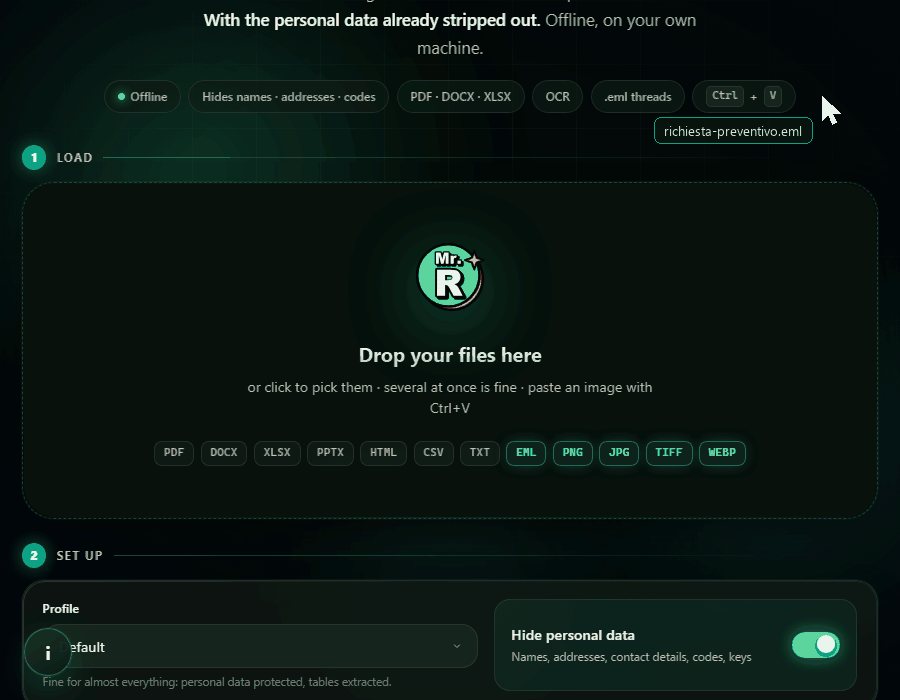
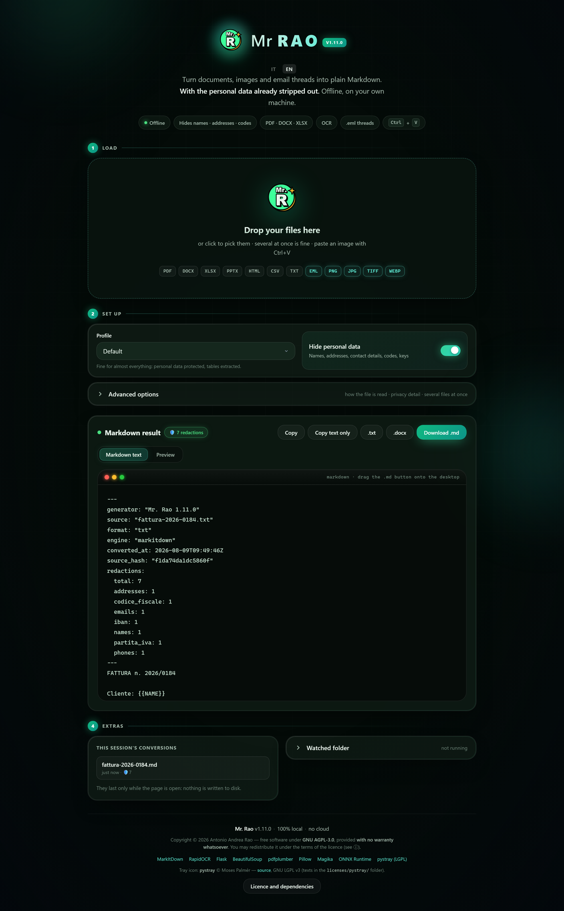

# Mr. Rao

**English** · [Italiano](README.it.md)

**Turn PDFs, Office files, scans and emails into clean Markdown — with the personal data already stripped out.**
**Export as `.md`, `.txt` or `.docx` — all three already redacted.**
**All on your own machine, without sending anything anywhere.**

[](https://github.com/AntonioRao/mr-rao/releases/latest/download/MrRao-Portable.zip)

[](https://github.com/AntonioRao/mr-rao/actions/workflows/ci.yml)
[](docs/CHANGELOG.md)
[](tests/)
[](#how-it-actually-stays-local)
[](LICENSE)
[](docs/PORTABLE.md)


### [⬇️ Download for Windows — no Python required](https://github.com/AntonioRao/mr-rao/releases/latest/download/MrRao-Portable.zip)

*Extract the zip, double-click `Installa Mr Rao.bat`. That's it.*
<sub>The download starts straight away. [All releases and release notes](https://github.com/AntonioRao/mr-rao/releases) · [changelog](docs/CHANGELOG.md)</sub>

<sub>**Want to be sure it is the right file?** The package is signed with [Sigstore](https://www.sigstore.dev/): `gh attestation verify MrRao-Portable.zip --repo AntonioRao/mr-rao` tells you whether it really came out of this repository, from which commit and which build. No key to obtain. Details and limits in [PORTABLE.md](docs/PORTABLE.md#verificare-il-pacchetto). The package is **not** Windows code-signed yet, so Windows will still call the publisher unknown: an application for free code signing through the [SignPath Foundation](https://signpath.org/) has been submitted, and the [code signing policy](docs/CODE-SIGNING-POLICY.md) says what will and will not change when it is granted.</sub>



<sub>An `.eml` with invented data: names, emails, phone numbers and IBANs become placeholders. The protocol number and the date stay where they were — the engine does not redact what it should not.</sub>



> **Interface and output in English or Italian**, chosen from your browser and switchable with one click — the produced Markdown follows the same language. Alongside the Italian formats (*codice fiscale*, *partita IVA*, BBAN) the engine recognises UK, US, Canadian and Australian ones: NHS number, National Insurance number, SSN, ITIN, ABA routing number, SIN, ABN, TFN, UK postcodes and passport MRZ lines — each with its own checksum where one exists. English name detection is context-driven and deliberately narrower than the Italian: [PRIVACY.en.md](docs/PRIVACY.en.md) says what that costs.

---

## The problem

You want to hand a document to an AI assistant. You need two things:

1. the text, clean, not a PDF;
2. **not** to hand over your client's tax ID while you're at it.

Online converters solve the first problem by creating the second: to convert the file, you have to upload it. If that file is an invoice, a medical record, a contract or an email thread with real people in it, you have just shipped it to a server you know nothing about.

Mr. Rao does the conversion **and** the redaction on your own computer. The file never moves.

### And not everything ends up in a prompt

A notice going up on a public register, a contract to be filed, a redacted decision **have to stay documents** — Markdown is not one. So the output is not only `.md`: there is plain `.txt`, and a **Word `.docx`** with the same redaction applied.

One thing worth knowing before you use it. **This is not the original document with black boxes drawn over it.** That is the classic redaction trap — the boxes come off and the text is still underneath, and every year somebody publishes a court filing that way. Here the document is rebuilt from the already-redacted Markdown, so the data is not covered: it is absent. The price is the layout of the original, which is lost.

---

## The redaction engine

The conversion is done by [MarkItDown](https://github.com/microsoft/markitdown), which is Microsoft's and is excellent. **This is the part you won't find elsewhere.**

### The number has to prove it is an IBAN

Every detector is a pair: a regular expression that proposes candidates, and a validator that decides. The pattern is never enough on its own.

| data | how it is decided |
|------|-------------------|
| IBAN | **mod-97** (ISO 13616) |
| Payment card | **Luhn** (ISO/IEC 7812) |
| Phone number | `+39` prefix, Italian mobile `3xx` prefix, separators, or a context word in front |
| VAT number | `IT` prefix, or fiscal context in the preceding characters |
| Street address | the keyword (`via`, `piazza`, `corso`) must be followed by a capitalised word |
| Date of birth | only next to "nato il", "data di nascita" |
| ID card, driving licence, passport | **the document type must be written nearby**: these numbers carry no check digit |

That last row is worth pausing on, because it is where the method meets its limit and shows what it does about it. A driving licence number has nothing to prove: `MI5512340V` and a reference code have the same shape, and no arithmetic can tell them apart. Replacing on sight would wipe out half an administrative file; staying silent would let an identity document through. So the engine looks at the surrounding text — over a wide window, because on a card **the document type is the heading**, six lines above the number. With no context the number stays, and is flagged as a suspect.

Which is why this survives untouched:

```
Protocollo interno: 0123456789      →  unchanged: no prefix, no separator
Registrata il 01.02.2024            →  unchanged: that is a date, not a number to call
Ordine 5551234567890123             →  unchanged: fails the Luhn check
```

And this does not:

```
IBAN IT60X0542811101000000123456    →  {{IBAN}}
Carta 4111 1111 1111 1111           →  {{CARD}}
cell. 335 123 4567                  →  {{PHONE}}
```

### Names: levels of evidence, not a list

No list of surnames is ever complete, and no list is enough on its own: "Chiesa", "Costa", "Monte" and "Villa" are real Italian surnames **and** words that appear on every other line of an administrative document. So the engine asks for proof, and how strong that proof has to be depends on what it is reading.

**It replaces** when the text declares that this is a person:

- **a professional title in front** — Dott., Ing., Geom., Avv., Mr, Dr, Prof;
- **a closing formula** — "Kind regards, Whitfield": a signature is the one place a surname on its own really is a surname;
- **a name next to an email address** — `Tizio Caio <t.caio@x.it>`, by far the commonest case in mail;
- **a first name and surname side by side**, both recognised.

**It flags and leaves alone** when the evidence is weak: a single list hit, a lone word, a run of capitals with nothing else around it. The document stays intact and whoever checks it knows where to look.

### Letter or form: the same rule points the other way

In a letter, two capitalised words of which one is in the lists are almost always a person. On a form they are almost always a field label: "Imposta Lorda", "Quadro RN", "Redditi Persone Fisiche".

That is not an impression, it is measured:

| | blank administrative documents | Italian prose |
|---|---|---|
| requiring **two** hits | 2,739 fewer wrong replacements | 3,918 fewer names caught |
| requiring **one** hit | 2,739 more | 3,918 more |

There is no single value that is right for both, so Mr. Rao **works it out from the file** — email is prose, spreadsheets are forms, and in PDFs it counts the boxes drawn on the page — and lets you override it when it gets that wrong.

There was a fourth rule that asked for no corroboration at all — "two capitalised words that are not Italian words" — and it was **retired in 1.13.0**. The reason is a number: on twenty blank Italian tax-office forms it produced 8,904 wrong replacements, and on twenty-seven forms downloaded from the issuing bodies in 2026 it went from 27 to 2,529. The flaw was not that it guessed: it is that it decided alone. **The price is stated plainly**: a name on neither list, with no title, signature or email address beside it, now stays — and does not even become a suspect.

### The guard that matters most

A filter that redacts everything is as useless as one that redacts nothing. The bench has **three populations**, and the first is the one that counts:

| | expected | what it is for |
|---|---|---|
| **100+ blank documents** — Italian and US tax forms, Gazzetta issues back to 1890, statistical volumes | **zero** | every replacement is an error by construction: there is nothing to judge by eye |
| 6,000 messages from Italian mailing lists | — | how it behaves on real prose |
| 1,500 messages in English | — | the same, in the other language |

The first one exists because of a defect found exactly that way: on a **blank** US tax form, the engine produced 22 replacements. A document with no personal data in it at all. A hand-written bench had never caught it, because a hand-written bench only contains the traps its author thought of.

### And what it cannot remove, it flags

The detectors look for **valid** shapes. A scan produces **almost** valid ones: `A01` read as `AD1`, `IT60` read as `lT60`. The structure fails, the data stays in the text — and stays readable by a person.

Replacing without certainty would mean redacting half the document. But saying nothing is worse, because **"3 redactions" on a clean document and "3 redactions" on a document the detector could not read are the same number and two opposite situations.**

So the result tells them apart:

```
🛡️ 3 redazioni · ⚠️ 2 da controllare
```

Suspects are masked — `RS••••••••••••2S` — enough to find them in the document, not to read them. And an administrative record full of protocol, resolution and tender numbers produces **zero** of them: if every number raised a flag, the flag would stop being worth reading.

### Your own words outrank the general rules

The rules hold for everyone, but the names that come up in **every** one of your files are known only to you. Two boxes in the privacy panel:

- **Always hide** — clients, counterparties, project names. One term per line; they become `{{TERM}}`.
- **Never touch** — internal designations, product names, your own company name.

The second is not the opposite of the first: it is **stronger**. A term written there is shielded from *every* recogniser — including the ones you would not know to switch off — it outranks "always hide", and it is not even flagged as a suspect, because you have already decided.

Both lists survive between conversions, on your own disk. They are the only thing Mr. Rao stores: documents and results live only while the page is open.

### The model reads, it does not decide

There are two neural networks in the portable package, and they are worth naming: RapidOCR ships about 30 MB of `.onnx` models to read scans, and MarkItDown loads a smaller one, 3 MB, to recognise file types. They run locally, offline, on your own CPU — but they are models.

What they do not do is **decide**. OCR turns pixels into characters and stops there; what counts as personal data is settled downstream by a regular expression and an arithmetic validator — mod-97 for IBANs, Luhn for payment cards, the check character of the Italian tax code. It is the same principle the whole engine rests on, *the pattern proposes, the validator decides*, and OCR sits upstream of even the pattern: no score, no threshold, nothing to train. The same text always yields the same result, and every replacement can be explained by pointing at the rule that produced it.

The reverse holds too, and it is why the scan bench finds what it finds: **when OCR reads badly, the engine cannot decide well.** On a faded photocopy a mangled IBAN never reaches mod-97, and no rule can recover a value the reader never read. That limit is measured, not hidden — it is written on the page below.

**→ [How it works in detail, limits included](docs/PRIVACY.en.md)**

---

## What it does

| | |
|---|---|
| 📄 **Documents** | PDF, DOCX, DOC, XLSX, XLS, PPTX, PPT, HTML, CSV, JSON, XML, TXT, RTF |
| 👁️ **Scans and photos** | Offline OCR on PNG, JPG, TIFF, WebP, BMP, GIF — and on scanned PDFs |
| 📊 **PDF tables** | Rebuilt as Markdown tables instead of unravelling into loose lines |
| 📧 **Email** | `.eml` files with the thread split message by message, attachments extractable |
| 🛡️ **Personal data** | Names, postal addresses, phone numbers, emails, URLs, tax IDs, VAT numbers, IBANs, payment cards, API keys → replaced with placeholders |
| 🔍 **Verification** | A before/after view showing exactly what was removed |
| ⌨️ **Clipboard shortcut** | Copy the text, press **Ctrl+Alt+R**, paste: what lands is already redacted — [how it works, and why it is not a keylogger](docs/SCORCIATOIA-APPUNTI.en.md) |
| 📁 **Watched folder** | Drop files in one folder, the `.md` files appear in another |
| 📝 **Export** | Markdown `.md`, plain text `.txt` and a **Word document `.docx`** — for records that have to stay documents |
| ⌨️ **Command line** | `convert`, `watch`, `health` — also from the portable executable |

---

## Why Mr. Rao

### 1. A bridge between raw documents and AI prompts (LLM-ready)

**The problem.** When a consultant, a lawyer or an analyst wants to use
ChatGPT, Claude or Perplexity to go through a contract, an invoice or an
email thread, they cannot paste personal data into it — GDPR, NDA,
professional confidentiality.

**What Mr. Rao does.** It takes any file — scanned PDF, Word, Excel, EML —
converts it to plain Markdown, extracts and removes the sensitive data, and
hands back text that is safe to paste into the AI. In a single step.

### 2. Native parsing of email threads (`.eml`)

Most tools see an email as a plain text file. Mr. Rao rebuilds the reply
chain, separates the quoted messages and redacts emails, phone numbers and
names inside each one ([`mr_rao/eml_parser.py`](mr_rao/eml_parser.py)). A
killer feature for legal and HR work.

### 3. Built for Italian and European formats

Tools written elsewhere fail on Italian formats. Mr. Rao ships arithmetic
validators for the Italian tax code, Italian IBAN (mod-97), VAT number and
payment cards (Luhn), which cuts false positives sharply — and yes, it works
on English documents too: NHS number, National Insurance, SSN, ITIN, ABA
routing, SIN, ABN, TFN and passport MRZ lines.

### 4. Active anti-cloud protection

Mr. Rao detects whether your "Documents" folder is synced with OneDrive,
Dropbox or Google Drive and automatically moves its working directory to a
100% local, unsynced folder
([`mr_rao/user_folders.py`](mr_rao/user_folders.py)) — so the file never
leaves the room.

---

## Getting started

### Windows, without installing Python

**[⬇️ Download the latest release](https://github.com/AntonioRao/mr-rao/releases/latest/download/MrRao-Portable.zip)** — then extract the zip and double-click **`Installa Mr Rao.bat`**.

Nothing else needed: Python, the OCR models and every dependency are already inside. The zip is ~165 MB, ~330 MB once installed.

Installing creates the desktop shortcut, the Start menu entry and the "Apri con Mr. Rao" right-click action on any file, with a dedicated entry for the ten commonest formats. `Disinstalla Mr Rao.bat` removes all of it — your working folders stay where they are.

### With Python

```bash
python -m venv venv
venv\Scripts\activate
pip install -r requirements.txt
python app.py
```

It opens at `http://127.0.0.1:5000`. If that port is busy it tells you **which instance** holds it. If the holder is Mr. Rao at the same version — i.e. you launched it twice — no second instance starts: that window is opened instead. If it is another program, or a Mr. Rao at a different version, it starts on the first free port and says why.

### Command line

```bash
python -m mr_rao.cli convert invoice.pdf -o invoice.md
python -m mr_rao.cli convert folder\*.pdf --merge -o all.md
python -m mr_rao.cli watch .\inbox .\outbox --move-done
```

**→ [Every command and every option](docs/CLI.md)**

### Docker

```bash
docker compose up --build
```

Published **on localhost only**: the app has no authentication, so exposing it to a network has to be a deliberate choice (put a reverse proxy with auth in front).

---

## Real use cases

**Law firm — an email thread to attach to a case file.**
An `.eml` with twenty stacked replies becomes readable Markdown, one message at a time, with the attachments pulled out. The "legal email" profile strips names, addresses and contact details, so what's left can go to a consultant or an AI assistant without exposing the other parties.

**Accountant — invoices and bookkeeping.**
The default profile rebuilds the tables and hides tax ID, VAT number and IBAN **while leaving the amounts visible** — they're the reason you're reading the document in the first place. Figures are not personal data, and no profile touches them.

**Anyone working with AI assistants.**
The "LLM-ready" profile produces lean text, no technical headers, personal data already replaced. Copy, paste, stop worrying.

**Public bodies — a record that has to be published.**
A decision going on a public register cannot go up as Markdown: it has to stay a document. The `.docx` export rebuilds it from the already-redacted text, so the data is not hidden under anything — it is not there. What does not survive is the layout of the original.

**Digitised paper archives.**
Watched folder plus the "OCR only" profile: empty your scanner into one folder and find the Markdown in the other, without sitting in front of the screen.

**Anyone who has to show their work.**
Each file can carry a header with its origin, date, engine used and **how many redactions** were applied. Useful when the conversion itself needs documenting.

---

## What it does NOT do

Better said upfront:

- **It is not a layout translator.** It produces structured text, not a graphical clone of the PDF. That goes for the `.docx` export too: it is a new document built from the redacted text, not the original cleaned up, so margins, fonts and page breaks do not survive.
- **Name redaction is not infallible.** It relies on a list of common Italian names, so an unusual surname can slip through. That is exactly why the before/after view exists — **always check** before sharing.
- **OCR works no miracles.** On a skewed, blurry scan it gets things wrong, like everything else.
- **Redaction is weaker on scanned documents.** The detectors look for a correctly spelled tax ID or IBAN: if OCR reads `A01` as `AD1`, the code is not recognised and stays in the text. The output flags this with a warning, but that is where the before/after view really earns its keep.
- **There is no authentication.** It is a local tool for one person, not a multi-user service.

---

## How it actually stays local

Not a slogan — something you can check:

- **There is not a single outbound network call in the app's own code.** The only `urlopen` in the codebase points at `127.0.0.1`, and it exists to identify which process holds a busy port. One command proves it: `grep -rn "urlopen\|requests\." mr_rao/`
- **The OCR models ship with the package.** No download on first run.
- **Working folders never land in a synced directory.** On Windows, "Documents" often *is* the OneDrive folder: Mr. Rao detects that and falls back to a local folder, telling you why — so a tool that promises nothing leaves your machine does not quietly sync your documents to a company cloud.
- **The local server defends itself.** `Host` header allow-list (against DNS rebinding) and rejection of cross-site requests (against CSRF), so no page open in your browser can drive Mr. Rao.

---

## Windows will say the publisher is unknown

It will, and you deserve to know why.

**It has nothing to do with the price of the software.** The package is not
signed with a code signing certificate — those cost a few hundred euros a
year, and there isn't one yet — and Windows has not built up reputation on
this file. Those are the two things SmartScreen looks at: signature and
reputation. Free signed software raises no warning; paid unsigned software
does.

But you don't have to take anyone's word for it. Before you even open the
zip, you can check **where it actually came from**:

```bash
gh attestation verify MrRao-Portable.zip --repo AntonioRao/mr-rao
```

It tells you which repository, which commit and which build produced that
file. The signature is [Sigstore](https://www.sigstore.dev/), made by the
workflow that builds the package: there is no private key lying around, and
the signature is recorded in a public log that cannot be quietly cleaned up
afterwards. That is a stronger guarantee than a GPG signature, where whoever
verifies still has to obtain the key and know that it is yours.

To check the file arrived intact, every release ships `SHA256SUMS.txt`:

```bash
sha256sum -c SHA256SUMS.txt
```

Then, if you decide to go ahead, the Windows warning is cleared with *More
info* → *Run anyway*.

## What's inside, transparently

Mr. Rao is **not** a fork of any of these projects: it uses them as dependencies, and their licences stay intact.

The conversion core is **[MarkItDown](https://github.com/microsoft/markitdown)** by Microsoft (MIT). OCR is **[RapidOCR](https://github.com/RapidAI/RapidOCR)** (Apache-2.0) on **[ONNX Runtime](https://onnxruntime.ai/)**, with the PP-OCRv6 models shipped inside the package — nothing is downloaded at first run. Everything else — Flask, BeautifulSoup, pdfplumber, Pillow — is listed in full in **[THIRD_PARTY.md](THIRD_PARTY.md)**.

> *Mr. Rao is not affiliated with or endorsed by Microsoft or any of the projects mentioned.*

That list is not maintained by hand: [`scripts/gen_third_party.py`](scripts/gen_third_party.py) **generates** it from the metadata of the packages actually installed, and the quality gate fails if it ever drifts from them. So it cannot quietly go stale.

One library is **LGPL** (pystray, for the system tray icon): its licence text, notice and replacement instructions live in [`licenses/`](licenses/).

---

## Licence

Copyright © 2026 Antonio Andrea Rao

Mr. Rao is **free software** under the **[GNU Affero General Public License v3.0](LICENSE)**.
You may use, study, modify and redistribute it — including commercially — under the terms of that licence.

**With no further obligation you may**: use it in your firm or company, including for paid work; install it on your clients' machines; build paid consulting, training or support around it.

**Section 13 only bites when two things happen together**: you *modify* Mr. Rao **and** you make it usable by others *over a network* (a web service, a company portal). Then you must offer the source of **your** version to the users of that service — not to the author. Whether you charge for it or not makes no difference: the AGPL does not look at price.

That is the gap the plain GPL leaves open: putting software on a server is not distributing copies, so without section 13 you could keep your changes to yourself. For a tool that lives on trust, that gap was worth closing.

**The name is the one thing the licence does not grant.** The code may be copied, modified and redistributed without exception; a modified version, however, must carry a different name and mark itself as different. The additional terms, permitted by section 7, are in [NOTICE.md](NOTICE.md).

This is a good-faith summary, not legal advice — the text that governs is [LICENSE](LICENSE).

Distributed **without any warranty**, in the hope that it will be useful.
Dependencies each remain under their own licence — see [THIRD_PARTY.md](THIRD_PARTY.md).

---

## Quality

```bash
scripts\quality_gate.bat
```

Six steps: compilation, importing every module one by one, dependency health, licence alignment, **1756 tests**, published-docs alignment.

The tests do not just cover the happy path. They cover the defects that cost the most: the profile × format matrix that uncovered broken OCR on PDFs, option isolation between files of the same batch, the busy-port behaviour on Windows, the GET request that wrote to disk, the folders that ended up in the cloud. Every regression test was verified **failing against the old code** first — a test that passes with the bug in place proves nothing.

---

## Documentation

- [Architecture](docs/ARCHITECTURE.en.md) · [Privacy](docs/PRIVACY.en.md) · [Privacy FAQ (reviewers)](docs/PRIVACY_FAQ.en.md) · [Changelog](docs/CHANGELOG.md)
- [Backlog](docs/BACKLOG.md) — what's missing, in priority order
- [Command line](docs/CLI.md) — every command and every option
- [Microsoft Store](docs/STORE.md) — the MSIX package and how it is published
- [Code signing policy](docs/CODE-SIGNING-POLICY.md) — who can cause a binary to be signed, and what has to be true first
- [Portable build](docs/PORTABLE.md) · [Security](SECURITY.en.md) · [Contributing](CONTRIBUTING.en.md)

## Configuration

| Variable | Default | Meaning |
|----------|---------|---------|
| `MR_RAO_PORT` | `5000` | Local server port |
| `MR_RAO_MAX_UPLOAD_MB` | `50` | Limit for the **whole request**, not per file |
| `MR_RAO_MAX_OCR_PAGES` | `50` | Maximum OCR pages per PDF |
| `MR_RAO_OCR_TIMEOUT` | `900` | Seconds a single OCR run may take (`0` = no limit) |
| `MR_RAO_MAX_WORKERS` | `2` | Concurrent conversions; the rest queue |
| `MR_RAO_FOLDER_ROOT` | automatic | Where to create the working folders |
| `MR_RAO_ALLOWED_HOSTS` | this machine's own addresses | Hosts accepted in the `Host` header |
| `MR_RAO_SECRET` | random at each start | Signing key; nothing uses it today ([why](SECURITY.en.md#signing-key)) |

---

*Mr. Rao — from document to Markdown. Offline.*
